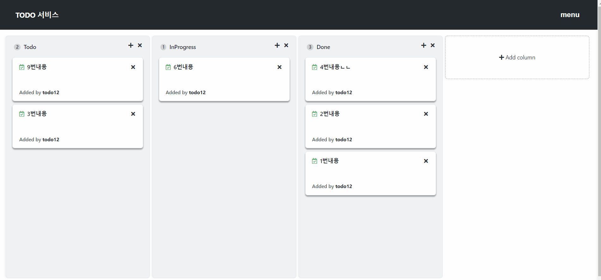

# [미션] TODO 리스트 서비스

## 기능구현 이미지

## issue관리

[요구사항 기능서](https://docs.google.com/spreadsheets/d/1eD8tuBxiQHYOtk7LWXB2ekjnvItjdt4UWi5ZC3x2kgk/edit#gid=0)

[issue](https://github.com/codesquad-member-2020/todo-12/issues?page=2&q=is%3Aissue+sort%3Aupdated-desc+is%3Aclosed)

## 회고

오늘부로 todo 미션이 끝이 났다. 이번 미션으로도 항상 그렇듯 배운 게 많은 것 같다.

로그인 시 token을 받아와 사용하는 방법을 익혔고
구조에 대해 고민하는 시간을 많이 가졌다.
서버에서 데이터를 받아오는데 과연 클라이언트에서도 데이터를 보관하고 있어야 할까?
또 다른 고민은 어떻게 하면 재사용이 가능하도록 할까
또는 기능을 빼거나 확장에 대해 자유롭게 가능할까 하는 여러 가지 고민을 한 것 같다.

결국 데이터를 보관하는 model을 만들어 데이터를 관리하고 model이 바뀌면 view가 바뀌도록 설계하였다. 이렇게 데이터를 보관하니 dom에 접근하지 않고도 데이터를 쉽게 찾을 수 있어 좋았고 여기서는 구현하지 않았지만 history 같은 경우는 서버에서 데이터를 받아와 보여줄 수도 있지만 먼저 보관했던 데이터를 사용자에게 빠르게 보여주고 후에 서버에 데이터를 한 번에 전달하는 방법도 생각해 볼 수 있을 것 같다 이렇게 함으로써 좀 더 사용자에게 빠르게 정보를 전달할 수 있을 것 같다.

model은 id로의 검색과 element의 검색이 가능하도록 두 가지 방법으로 모두 데이터를 관리했고 column이나 card의 element를 넣으면 정보를 얻을 수 있도록 하였다.

그리고 이번 미션에서 한 설계는 column이라는 큰 축이 있고 여기서 model이 모든 데이터를 관리하며 view는 model이 바뀌면 바뀐 화면을 렌더링 한다. controller는 초기 화면 렌더링과 이벤트 등록을 담당하도록 하며 각 component들에게 event를 전달해 주는 역할을 하도록 했다.

거기서 기능을 확장하거나 뺄 수 있도록 하고 싶어서 기능들을 각각 따로 구현했다. 추가 기능 삭제 기능 수정 기능 등을 언제든 뺄 수 있고 추가할 수 있도록 하자 해서 각각 구현하였다.

처음에 구조가 계속 바뀌면서 혼란이 왔었지만 여러 가지 구조를 적용해보며 각각의 장단점을 발견한 것 같다.

## 이번 미션에서 공부한 키워드
- fetch 두번째 인자 (body, header)
- submit, button차이
- submit과 fetch 데이터 전송 차이
- css animation

## 추가 공부 할 점
- 비동기 처리
- class구조와 패턴
- drag and drop다시 구현해 보기

## 잘한 점
- 기능을 전부 구현한것
- 구조를 계속 고민하고 수정한 것
- 이슈작성과 요구사항분석을 초반에 시간을 투자해서 작성한 것
- 팀원과 소통을 자주 한 것

## 아쉬운 점
- 데모 시간을 못맞춘것
- 마지막에 급하게 수정하느라 에러를 확인못하고 그냥 배포한 것
- commit을 신경써서 못한 것
- 마지막에 빌드할때 webpack이 오류난 것
- 앞으로는 시간 여유를 두고 배포를 준비해야겠다...

[팀프로젝트 회고](https://docs.google.com/spreadsheets/d/1fJFNi1TQ0JLXc9f8Ty3dngoTvGK8dPKeVfhXwNd2_8k/edit#gid=1950847730)

## 코드리뷰
[코드리뷰](https://github.com/codesquad-member-2020/todo-12/pull/75)

### 잘한 점
- 이벤트 바인딩을 모아서 한 것
  
- root 컴포넌트를 만들어서 공통부분을 분리한 것
  
- entry point 가 되는 index.js 에서는 모든 컴포넌트들의 관계가 잘 보인 것
  

### 아쉬운 점

- fetchData 에서 Authorization을 포함한 header는 필수가 아닐수도 있으니,
header도 파라미터로 받도록하자

- component.js 라고 하니까 아주 범용적으로 사용가능한 것 같은 느낌
XXXCoreComponent.js 와 같은 네이밍도 나쁘지 않을 듯.

- arguments가 많으면 객체형태로 묶어서 전달하자

- util함수 이름을 다른사람도 쉽게 알 수 있도록 수정하자

  

